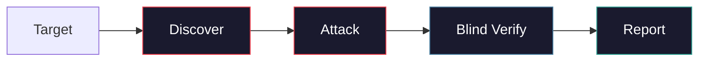
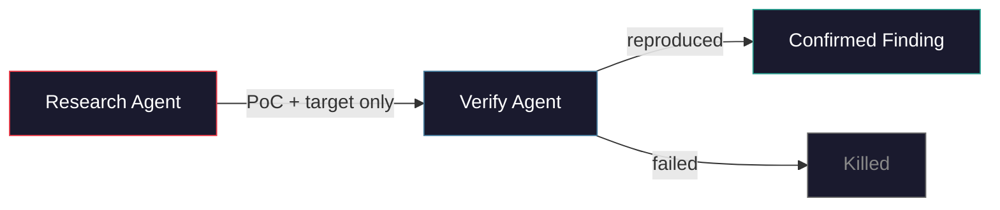
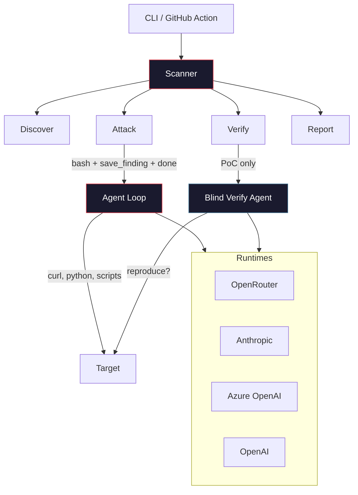

<p align="center">
 
</p>

<h1 align="center">pwnkit</h1>

<p align="center">
 <strong>Let autonomous AI agents hack you so the real ones can't.</strong><br/>
 <em>Fully autonomous agentic pentesting framework.</em>
</p>

<p align="center">
 <a href="https://www.npmjs.com/package/pwnkit-cli"></a>
 <a href="https://github.com/peaktwilight/pwnkit/blob/main/LICENSE"></a>
 <a href="https://github.com/peaktwilight/pwnkit/actions"></a>
 <a href="https://github.com/peaktwilight/pwnkit/stargazers"></a>
 <a href="https://pwnkit.com"></a>
</p>

<p align="center">
 
</p>

<p align="center">
 <a href="https://docs.pwnkit.com">Docs</a> &middot;
 <a href="https://pwnkit.com">Website</a> &middot;
 <a href="https://pwnkit.com/blog">Blog</a> &middot;
 <a href="#benchmark">Benchmark</a>
</p>

---

Autonomous AI agents that pentest **web apps**, **AI/LLM apps**, **npm packages**, and **source code**. The agent gets a `bash` tool and works like a real pentester -- writing curl commands, Python exploit scripts, and chaining vulnerabilities. Every finding is independently re-exploited by a blind verify agent to kill false positives.

```bash
npx pwnkit-cli
```

## Quick Start

```bash
# Pentest a web app
npx pwnkit-cli scan --target https://example.com --mode web

# White-box scan with source code access
npx pwnkit-cli scan --target https://example.com --repo ./source

# Scan an LLM API
npx pwnkit-cli scan --target https://your-app.com/api/chat

# Audit an npm package
npx pwnkit-cli audit lodash

# Review source code
npx pwnkit-cli review ./my-app

# Auto-detect -- just give it a target
npx pwnkit-cli https://example.com
```

See the [documentation](https://docs.pwnkit.com) for configuration, runtime modes, and CI/CD setup.

## How It Works



**Shell-first approach.** The agent gets 3 tools: `bash`, `save_finding`, `done`. It runs curl, writes Python scripts, chains exploits -- the same way a human pentester works. No templates, no static rules.

**Blind PoC verification.** The verify agent receives *only* the PoC and the target path. It has zero access to the research agent's reasoning or findings description. If it can't independently reproduce the exploit, the finding is killed. This eliminates confirmation bias and drastically reduces false positives.



### What It Scans

| Target | Command | What it finds |
|--------|---------|---------------|
| **Web apps** | `scan --target <url> --mode web` | SQLi, IDOR, SSTI, XSS, auth bypass, SSRF, LFI, RCE, file upload, deserialization |
| **AI/LLM apps** | `scan --target <url>` | Prompt injection, jailbreaks, system prompt extraction, PII leakage, MCP tool abuse |
| **npm packages** | `audit <pkg>` | Malicious code, known CVEs, supply chain attacks |
| **Source code** | `review <path>` | Security vulnerabilities via static + AI analysis |
| **White-box** | `scan --target <url> --repo <path>` | Source-aware scanning -- reads code before attacking |

## Benchmark

Validated across 5 benchmark suites. Full breakdowns at [docs.pwnkit.com/benchmark](https://docs.pwnkit.com/benchmark).

### XBOW (traditional web vulnerabilities)

[XBOW](https://github.com/xbow-engineering/validation-benchmarks) is the standard benchmark for autonomous web pentesters: 104 Docker CTF challenges covering SQLi, IDOR, SSTI, RCE, SSRF, and more. Each challenge hides a `FLAG{...}` behind a real vulnerability.

| Tool | Score | Notes |
|------|-------|-------|
| [Shannon](https://github.com/KeygraphHQ/shannon) | 96.15% (100/104) | White-box, modified benchmark fork, reads source code |
| [KinoSec](https://kinosec.ai) | 92.3% (96/104) | Proprietary, self-reported |
| [XBOW](https://xbow.com) | 85% (88/104) | Own agent on own benchmark |
| [Cyber-AutoAgent](https://github.com/westonbrown/Cyber-AutoAgent) | 84.62% (88/104) | Open-source, archived |
| [deadend-cli](https://github.com/xoxruns/deadend-cli) | 77.55% (76/98) | Only tested 98 challenges |
| [MAPTA](https://arxiv.org/abs/2508.20816) | 76.9% (80/104) | Patched 43 Docker images |
| **pwnkit** | **33.7% (35/104)** | Open-source, 3 tools, many challenges don't build on our infra |

**Context on pwnkit's score:** ~40 of 104 challenges don't build on arm64 (phantomjs, mysql:5.7, python:2.7 base images). On challenges that actually build and run, pwnkit scores **73% locally** and **78% in white-box CI mode**. We've only tested ~60 of 104 challenges total. No competitor publishes retry counts or cost per challenge.

White-box mode (`--repo`) flips previously impossible challenges by reading source code before attacking.

### AI/LLM Security

10/10 on our regression test suite: prompt injection, jailbreaks, system prompt extraction, PII leakage, encoding bypass, multi-turn escalation, MCP SSRF. These are self-authored challenges, not an independent benchmark.

### Other Suites

| Suite | Description | Status |
|-------|-------------|--------|
| [AutoPenBench](https://github.com/lucagioacchini/auto-pen-bench) | 33 network/CVE pentesting tasks | Runner built, needs Linux Docker |
| [HarmBench](https://www.harmbench.org/) | 510 LLM safety behaviors | Harness built, needs target LLM |
| npm audit | 30 packages (malicious + CVE + safe) | Runner built |

## GitHub Action

```yaml
- uses: peaktwilight/pwnkit@main
  with:
    mode: review
    path: .
    format: sarif
  env:
    OPENROUTER_API_KEY: ${{ secrets.OPENROUTER_API_KEY }}
```

## Architecture



## Contributing

```bash
git clone https://github.com/peaktwilight/pwnkit.git
cd pwnkit && pnpm install && pnpm test
```

See [CONTRIBUTING.md](CONTRIBUTING.md) for guidelines.

## Built By

Created by a security researcher with [7 published CVEs](https://doruk.ch/blog). pwnkit exists because modern attack surfaces need agents that adapt, not static rules that don't.

---

*Built by [Peak Twilight](https://doruk.ch) -- also building [FoxGuard](https://foxguard.dev), [vibecheck](https://vibechecked.doruk.ch), [unfuck](https://unfcked.doruk.ch), [whatdiditdo](https://whatdiditdo.doruk.ch)*

## License

[Apache 2.0](LICENSE)
