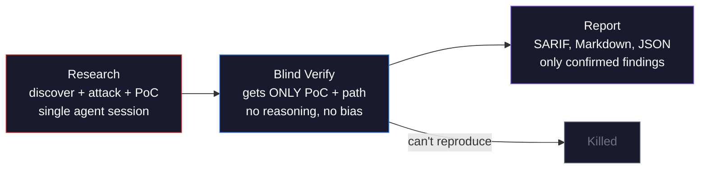

<p align="center">
 
</p>

<h1 align="center">pwnkit</h1>

<p align="center">
 <strong>General-purpose autonomous pentesting framework</strong><br/>
 <em>Scan LLM endpoints. Audit npm packages. Review source code. Re-exploit to kill false positives.</em>
</p>

<p align="center">
 <a href="https://www.npmjs.com/package/pwnkit-cli"></a>
 <a href="https://github.com/peaktwilight/pwnkit/blob/main/LICENSE"></a>
 <a href="https://github.com/peaktwilight/pwnkit/actions"></a>
 <a href="https://github.com/peaktwilight/pwnkit/stargazers"></a>
 <a href="https://pwnkit.com"></a>
</p>

<p align="center">
 
</p>

<p align="center">
 <a href="#quick-start">Quick Start</a> &middot;
 <a href="#commands">Commands</a> &middot;
 <a href="#how-it-works">How It Works</a> &middot;
 <a href="#what-pwnkit-scans">What It Scans</a> &middot;
 <a href="#roadmap">Roadmap</a> &middot;
 <a href="#how-it-compares">Comparison</a> &middot;
 <a href="#github-action">CI/CD</a> &middot;
 <a href="#built-by">About</a>
</p>

---

pwnkit is an open-source agentic security toolkit. A research agent discovers, attacks, and writes proof-of-concept code for vulnerabilities across LLM endpoints, npm packages, and Git repositories. Then a blind verify agent — given ONLY the PoC and file path, not the reasoning — independently reproduces each finding to **kill false positives**. No templates, no static rules — multi-turn agentic reasoning that thinks like an attacker.

One command. Zero config. Every finding re-exploited or dropped.

## Quick Start

```bash
# Scan an LLM endpoint
npx pwnkit-cli scan --target https://your-app.com/api/chat

# Scan a traditional web app for CORS, header, and exposure issues
npx pwnkit-cli scan --target https://example.com --mode web

# Audit an npm package for vulnerabilities
npx pwnkit-cli audit lodash

# Deep security review of a codebase
npx pwnkit-cli review ./my-ai-app

# Or just point pwnkit-cli at a target — it auto-detects what to do
npx pwnkit-cli express     # audits npm package
npx pwnkit-cli ./my-repo    # reviews source code
npx pwnkit-cli https://github.com/user/repo # clones and reviews
```

That's it. pwnkit discovers your attack surface, launches targeted attacks, verifies findings, and generates a report — all in under 5 minutes.

### Auto-Detect

`pwnkit-cli <target>` figures out what you mean without explicit subcommands:

| Input | What pwnkit-cli does |
|-------|-----------------|
| `pwnkit-cli express` | Treats it as an npm package name and runs `audit` |
| `pwnkit-cli ./my-repo` | Detects a local path and runs `review` |
| `pwnkit-cli https://github.com/user/repo` | Clones the repo and runs `review` |
| `pwnkit-cli https://example.com/api/chat` | Detects an LLM endpoint URL and runs `scan` |

Explicit subcommands (`scan`, `audit`, `review`) still work — auto-detect is just a convenience layer on top.

## Commands

All commands are available via `npx pwnkit-cli <command>`. Explicit subcommands are optional — thanks to auto-detect, `npx pwnkit-cli <target>` works for most use cases (see [Auto-Detect](#auto-detect) above).

pwnkit ships five commands — from quick API probes to deep source-level audits:

| Command | What It Does | Example |
|---------|-------------|---------|
| **`scan`** | Probe LLM endpoints or web apps for vulnerabilities | `npx pwnkit-cli scan --target https://api.example.com/chat` |
| **`audit`** | Install and security-audit any npm package with static analysis + AI review | `npx pwnkit-cli audit express@4.18.2` |
| **`review`** | Deep source code security review of a local repo or GitHub URL | `npx pwnkit-cli review https://github.com/user/repo` |
| **`history`** | Browse past scans with status, depth, findings count, and duration | `npx pwnkit-cli history --limit 20` |
| **`findings`** | Query, filter, and inspect verified findings across all scans | `npx pwnkit-cli findings list --severity critical` |

## How It Works

pwnkit runs autonomous AI agents in a research-then-verify pipeline. Each agent uses tools (`read_file`, `run_command`, `send_prompt`, `save_finding`) and makes multi-turn decisions — adapting its strategy based on what it learns:



| Agent | Role | What It Does |
|-------|------|-------------|
| **Research** | Discover + Attack + PoC | Maps endpoints, detects models, extracts system prompts, crafts multi-turn attacks (prompt injection, jailbreaks, tool poisoning, data exfiltration), and writes proof-of-concept code — all in one agent session |
| **Verify** | Blind validation | Gets ONLY the PoC code and file path — not the research agent's reasoning. Independently traces data flow and reproduces each finding. Can't reproduce? Killed as false positive |
| **Report** | Output | SARIF for GitHub Security tab, Markdown for humans, JSON for pipelines — only confirmed findings with severity scores and remediation |

The **blind verification is the differentiator.** The verify agent can't be biased by the research agent's reasoning — same principle as double-blind peer review. No more triaging 200 "possible prompt injections" that turn out to be nothing.

## What pwnkit Scans

| Target | Command | How |
|--------|---------|-----|
| **LLM Endpoints** — ChatGPT, Claude, Llama APIs, custom chatbots | `pwnkit-cli scan --target <url>` | HTTP probing + multi-turn agent attacks |
| **Web Apps** — Traditional websites and HTTP services | `pwnkit-cli scan --target <url> --mode web` | Deterministic checks for CORS, security headers, exposed files, and fingerprint leakage |
| **npm Packages** — Dependency supply chain, malicious code | `pwnkit-cli audit <package>` | Installs in sandbox, runs semgrep + AI code review |
| **Git Repositories** — Source-level security review | `pwnkit-cli review <path-or-url>` | Deep analysis with Claude Code, Codex, or Gemini CLI |
| **Auto-detect** — Give it anything | `pwnkit-cli <target>` | URL, package name, or path — pwnkit-cli figures it out |

## Example Output

See the [demo GIF above](#) for real scan output, or run it yourself:

```bash
npx pwnkit-cli scan --target https://your-app.com/api/chat --depth quick
```

For a verbose view with the animated attack replay:

```bash
npx pwnkit-cli scan --target https://your-app.com/api/chat --verbose
```

## Scan Depth

| Depth | Test Cases | Time |
|-------|-----------|------|
| `quick` | ~15 | ~1 min |
| `default` | ~50 | ~3 min |
| `deep` | ~150 | ~10 min |

pwnkit is an agentic harness — bring your own AI. Use your API key (OpenRouter, Anthropic, OpenAI), or use the Claude Code CLI, Codex CLI, or Gemini CLI with your existing subscription via `--runtime claude`, `--runtime codex`, or `--runtime gemini`.

```bash
# Quick scan for CI
npx pwnkit-cli scan --target https://api.example.com/chat --depth quick

# Baseline web app pentest
npx pwnkit-cli scan --target https://example.com --mode web

# Deep audit before launch
npx pwnkit-cli scan --target https://api.example.com/chat --depth deep

# Deep scan with Claude Code CLI
npx pwnkit-cli scan --target https://api.example.com/chat --depth deep --runtime claude

# Audit an npm package
npx pwnkit-cli audit react --depth deep --runtime claude

# Review a GitHub repo
npx pwnkit-cli review https://github.com/user/repo --runtime codex --depth deep

# Auto-detect — just give it a target
npx pwnkit-cli express
npx pwnkit-cli ./my-repo
npx pwnkit-cli https://api.example.com
```

## Runtime Modes

Bring your own agent CLI — pwnkit orchestrates it:

| Runtime | Flag | Best For |
|---------|------|----------|
| `api` | `--runtime api` | CI, quick scans — uses your API key (OpenRouter, Anthropic, OpenAI). Default |
| `claude` | `--runtime claude` | Deep analysis — spawns Claude Code CLI with your subscription |
| `codex` | `--runtime codex` | Source analysis — spawns Codex CLI |
| `gemini` | `--runtime gemini` | Large context source analysis — spawns Gemini CLI |
| `auto` | `--runtime auto` | Auto-detects installed CLIs, picks best per stage |

## Roadmap

The short version:

- now: resumable scans, finding triage, diff-aware PR review, deterministic replay
- next: multi-target orchestration, local mission-control dashboard, fuzzy navigation across scans/findings
- later: policy packs, trends, and distributed workers

The detailed roadmap lives in [ROADMAP.md](./ROADMAP.md).

## How It Compares

| Feature | pwnkit | promptfoo | garak | semgrep | nuclei |
|---------|--------|-----------|-------|---------|--------|
| **Agentic multi-turn pipeline** | Yes — Autonomous agents with tool use | No — Single runner | No — Single runner | No — Rule-based | No — Template runner |
| **Verification (no false positives)** | Yes — Re-exploits to confirm | No | No | No | No |
| **LLM endpoint scanning** | Yes — Prompt injection, jailbreaks, exfil | Yes — Red-teaming | Yes — Probes | No | No |
| **npm package audit** | Yes — Semgrep + AI review | No | No | Yes — Rules only | No |
| **Source code review** | Yes — AI-powered deep analysis | No | No | Yes — Rules only | No |
| **OWASP LLM Top 10** | Yes — Covered | Partial | Partial | N/A | N/A |
| **SARIF + GitHub Security tab** | Yes | Yes | No | Yes | Yes |
| **One command, zero config** | Yes — `npx pwnkit-cli scan` | Needs YAML config | Needs Python setup | Needs rules config | Needs templates |
| **Open source** | Yes — Apache-2.0 | Yes — (acquired by OpenAI) | Yes — MIT | Yes — LGPL / Paid Pro | Yes — MIT |
| **Pricing** | Free + bring your own AI | Varies | Free (local) | Free (OSS) / Paid (Pro) | Free |

pwnkit isn't replacing semgrep or nuclei — it covers the AI-specific attack surface they can't see. Use them together.

## GitHub Action

Add pwnkit to CI with a single root action. It can review source code, audit npm packages, or scan endpoints, posts a stable PR comment on reruns, and can upload SARIF directly when you set `format: sarif`.

```yaml
name: AI Security Scan
on: [push, pull_request]

permissions:
 contents: read
 issues: write
 security-events: write

jobs:
 pwnkit:
  runs-on: ubuntu-latest
  steps:
   - uses: actions/checkout@v4

   - name: Run pwnkit
    uses: peaktwilight/pwnkit@main
    with:
     mode: review
     path: .
     depth: default # quick | default | deep
     severity-threshold: high # critical | high | medium | low | info | none
     threshold: 0 # fail if qualifying findings exceed this count
     format: sarif # json | sarif
    env:
     OPENROUTER_API_KEY: ${{ secrets.OPENROUTER_API_KEY }}
```

> **API Key Priority:** pwnkit checks for `OPENROUTER_API_KEY` first, then `ANTHROPIC_API_KEY`, then `OPENAI_API_KEY`. OpenRouter gives you access to many models (including free ones) through a single key at [openrouter.ai](https://openrouter.ai).

Use `mode: audit` with `package: express@latest` for dependency review, or `mode: scan` with `target: https://example.com/api/chat` for endpoint scanning. When `format: sarif` is enabled, findings also show up in the **Security** tab of your repository.

### Badge

Add a pwnkit badge to your README:

```markdown
[](https://pwnkit.com)
```

The badge auto-updates from your GitHub Actions scan results. Shows `verified` (green), finding counts (yellow/red), or `not scanned` (gray).

Also available as a [shields.io endpoint](https://shields.io/endpoint):
```
https://img.shields.io/endpoint?url=https://pwnkit.com/badge/YOUR_ORG/YOUR_REPO/shield
```

## Findings Management

Every finding is persisted in a local SQLite database. Query across scans:

```bash
# List critical findings
npx pwnkit-cli findings list --severity critical

# Filter by category
npx pwnkit-cli findings list --category prompt-injection --status confirmed

# Inspect a specific finding with full evidence
npx pwnkit-cli findings show NF-001

# Browse scan history
npx pwnkit-cli history --limit 10
```

Finding lifecycle: `discovered → verified → confirmed → scored → reported` (or `false-positive` if verification fails).

## Roadmap

- [x] Core autonomous agent pipeline (research, blind verify, report)
- [x] OWASP LLM Top 10 coverage
- [x] SARIF output + GitHub Action
- [x] npm package auditing
- [x] Source code review (local + GitHub)
- [x] Multi-runtime support (Claude, Codex, Gemini)
- [x] Multi-turn agentic attacks (agents adapt payloads based on responses)
- [ ] MCP server scanning (tool poisoning, schema abuse)
- [ ] Web pentesting mode (SQLi, XSS, SSRF, auth bypass, IDOR)
- [ ] RAG pipeline security (poisoning, extraction)
- [ ] Agentic workflow testing (multi-tool chains)
- [ ] VS Code extension
- [ ] Team dashboard & historical tracking
- [ ] SOC 2 / compliance report generation

## Built By

Created by a security researcher with [7 published CVEs](https://doruk.ch/blog) across node-forge, mysql2, uptime-kuma, liquidjs, picomatch, and jspdf.

pwnkit is a general-purpose autonomous pentesting framework. It exists because modern attack surfaces — LLM endpoints, npm supply chains, AI-powered codebases — require agents that adapt, not static rules that don't. You can't `nmap` a language model. You can't write a rule for a jailbreak that hasn't been invented yet. Static analysis alone misses logical flaws and semantic vulnerabilities that only an agent tracing data flow can find.

pwnkit uses autonomous agents that think like attackers, adapt their strategy mid-scan, and re-exploit every finding before reporting it. The result: real vulnerabilities, zero noise.

## Contributing

Contributions welcome! See [CONTRIBUTING.md](CONTRIBUTING.md) for guidelines.

```bash
git clone https://github.com/peaktwilight/pwnkit.git
cd pwnkit
pnpm install
pnpm test
```

## License

[Apache 2.0](LICENSE) — use it, fork it, ship it.
